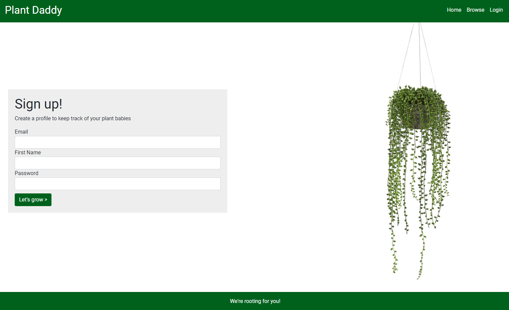
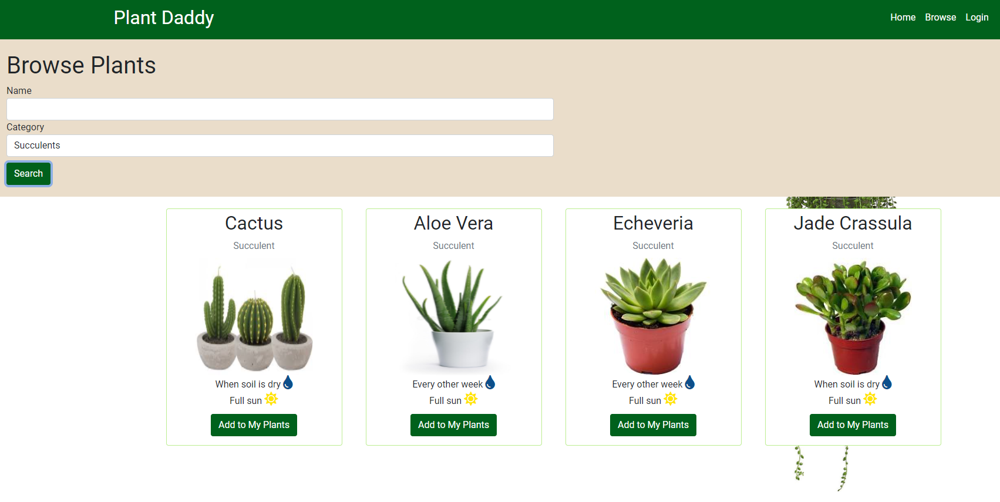

# Plant Daddy

## Description
An application, deployed to Heroku, where users can browse plants, create a profile, and add plants to their profile to keep track of their individual plants' needs.

## Table of Contents
  * [Installation](#installation)
  * [Usage](#usage)
  * [License](#license)
  * [Contributing](#contributing)
  * [Tests](#tests)
  * [Screenshots](#screenshots)
  * [Questions](#questions)

  ## Installation
  To use this application, you will navigate to the Heroku site [here](https://uofu-plant-daddy.herokuapp.com/)
  GitHub repository can be found [here](https://github.com/alyssawinn/plant-daddy)

  ## Usage
  N/A

  ## License
  N/A

  ## Contributing
  * Alyssa Winn
  GitHub: https://github.com/alyssawinn
  
  * Jaden Robison
  GitHub: https://github.com/jadenrobison8
  
  * Travis Alston
  GitHub: https://github.com/TravisAlston
  
  * Michael O'Reilly
  GitHub: https://github.com/Wampastomp99

  ## Tests
  N/A

  ## Screenshots
  

  

  ## Questions
  If you have any questions, please contact us at admin@plantdaddy.com